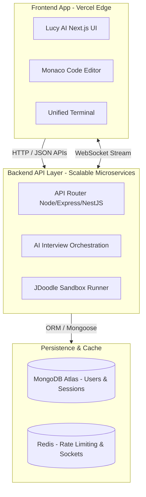

# Lucy AI - Production Deployment & Architecture Blueprint

This guide details the steps to deploy the **Lucy AI** DSA coaching platform to **Vercel** and provides an architectural blueprint for future backend/database scaling.

---

## 🚀 Part 1: Vercel Frontend Deployment Steps

Vercel is the native hosting platform for Next.js and fully supports serverless API routes, optimized edge assets, and production scaling.

### Step 1: Push Codebase to GitHub/GitLab
Ensure your clean codebase is version-controlled and pushed to a private repository:
```bash
git init
git add .
git commit -m "chore: prepare for production deployment"
# Link to your repository and push:
git remote add origin git@github.com:yourusername/lucy-ai.git
git branch -M main
git push -u origin main
```

### Step 2: Create a Project in Vercel
1. Log into the [Vercel Dashboard](https://vercel.com).
2. Click **Add New** > **Project**.
3. Import your `lucy-ai` repository.

### Step 3: Configure Build & Environment Settings
1. **Framework Preset:** Vercel automatically detects `Next.js`. Keep this preset.
2. **Root Directory:** Keep as `./` (or `ai-coding-mentor` depending on your monorepo structure).
3. **Build Command:** `npm run build`
4. **Output Directory:** `.next`
5. **Environment Variables:** Expand this section and add your keys from `.env.example`:
   * `NEXT_PUBLIC_APP_URL` (Set to your custom domain or Vercel generated preview URL)
   * `OPENROUTER_API_KEY` (Your OpenRouter credential)
   * `JDOODLE_CLIENT_ID` (Your JDoodle execution service client ID)
   * `JDOODLE_CLIENT_SECRET` (Your JDoodle execution service secret key)

### Step 4: Click Deploy!
Vercel will provision the runtime environment, build the static pages, compile the API routes, and deploy the application in under 2 minutes.

---

## 🛠️ Part 2: Production Readiness Checklist

We have proactively addressed and hardened the app for Vercel's production environment:

1. **Client-Server Boundaries:**
   * Monaco Editor (`@monaco-editor/react`) is dynamically imported with `{ ssr: false }` inside `components/CodeEditor.tsx`. This avoids Node.js SSR import mismatches.
2. **Hydration Conflict Resolution:**
   * Responsive panel caching states inside `localStorage` are cleared inside an isolated `useEffect` hook on client mount. This guarantees zero SSR hydration warnings.
3. **Environment Isolation:**
   * All API keys, tokens, and client secrets are strictly loaded through the safe server-side `process.env` lifecycle, preventing compile-time leaks of credentials into your client bundle.

---

## 🧭 Part 3: Future Backend Separation Roadmap

To prepare the application for future scaling, database integration, and high-frequency real-time systems (like voice streaming and websockets), we have structured a clean architectural boundary.



### 1. Refactoring Frontend vs. Backend Boundaries (Phase 2)
Currently, all API handlers reside inside Next.js `/app/api`. To transition to a standalone backend (e.g. Express, NestJS, or Go):
* **Move Handlers:** Move files inside `app/api/*` into a separate `/backend` microservice.
* **Update fetch URLs:** Replace local fetches (e.g. `fetch('/api/run')`) with an external base URL variable (e.g. `fetch('${process.env.NEXT_PUBLIC_API_URL}/run')`).

### 2. Scalable Database Integration (MongoDB)
For user auth, code history, streak tracking, and interview logs:
* Establish a database interface layer (`Mongoose` schema models) inside `lib/interview/persistence`.
* Update `/api/interview/submit` to persist submission records and scores directly to MongoDB.

### 3. High-Frequency Real-time Sockets & Voice Streaming
To implement AI audio chats (simulating natural conversational interviews):
* **WebSocket Integration:** Add `socket.io` or NestJS WebSockets on the external backend.
* **Audio Pipeline:** Use Web Audio APIs on the client to stream microphone inputs, processing speech-to-text on the backend via OpenAI Whisper or LiveKit, and returning instant audio streams to the user.
